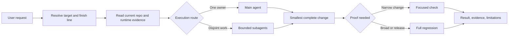
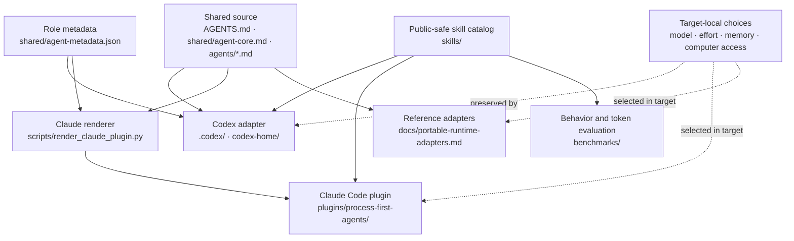

# agent-bootstrap

[English](README.md) | [한국어](README.ko.md) | [日本語](README.ja.md) | [简体中文](README.zh-CN.md)

[](https://github.com/hun99999/agent-bootstrap/commits/main)
[](#current-supported-surfaces)
[](benchmarks/README.md)

## Master Prompt

Paste this into Codex or Claude Code while the agent is in a clone of this repository:

<details>
<summary><strong>Open the one-paste setup prompt</strong></summary>


```text
Set up agent-bootstrap end to end from this repository.

First read AGENTS.md, README.md, docs/agent-setup-playbook.md, docs/global-guardrail-setup.md, docs/vibe-coding-guardrails.md, docs/agent-bootstrap-structure.md, and docs/local-project-knowledge-template.md. Do not invent commands, package names, configuration options, or API details.

Before changing anything, run git status --short --branch. If there is uncommitted or untracked user work, stop and ask how to handle it. Identify whether the current harness is Codex or Claude Code. Identify my requested scope.

Before rendering local configuration, ask what name the active agent should use to address me. Inspect only the active harness. Preserve an existing machine-local model and reasoning selection; on a fresh target, inherit the runtime defaults unless I explicitly choose a supported model or effort. Keep the chosen name local. Do not commit the chosen name or rendered files that contain it.

Read docs/frontend-design-stack.md. Validate the tracked frontend-design-pack, report whether Figma is available without authenticating it, and ask before installing or replacing any runtime plugin copy. If installation is approved, validate the installed root separately and use a fresh task or session to prove discovery.

Choose the smallest valid scope:
- If you are already inside Codex, configure Codex only unless I explicitly ask for Claude Code too.
- If you are already inside Claude Code, configure Claude Code only unless I explicitly ask for Codex too.
- If no supported harness is clear, stop and ask which supported harness to configure.
- If this is an application repository, apply the project guardrails and create project-local knowledge guidance.
- Do not install optional tools just because they are mentioned.

Set up the selected scope end to end:
- install or render the shared core using this repository's documented commands
- treat upstream Superpowers as optional: keep the Codex installer default at `skip`, and use `--superpowers-mode manual` only after I explicitly opt in
- regenerate Claude plugin output if shared prompts or metadata changed
- use karpathy-guidelines as the public default base skill
- keep hun-engineering-loop local to Hun-specific runtime setups unless I explicitly approve publishing that wrapper into a project
- do not install chatgpt-collaboration-harness into Claude Code
- inventory optional tools such as Obsidian, Lumin Repo Lens, dependency lint, strict type checks, cycle detection, and complexity limits; classify each as required, recommended, optional, or skipped; ask before installing anything
- keep private paths, credentials, MCP endpoints, auth state, browser profiles, and machine-specific trust settings out of tracked files
- run the repository's real verification commands, including tests and scripts/audit_agent_stack.py when available
- run post-write review for duplicate helpers, hidden coupling, swallowed errors, fallback drift, unmanaged re-exports, fan-in/fan-out hotspots, weak tests, generated-output drift, and private path leakage
- commit small reviewable changes when appropriate, then summarize what changed, what was installed, commands run, verification results, and remaining risks
```

</details>

Bootstrap a process-first AI coding environment for Codex and Claude Code.

`agent-bootstrap` gives a fresh clone a thin process-first core, role-based subagents, token-efficient execution habits, detailed setup docs, a public-safe skill model based on `karpathy-guidelines`, and an optional path to `superpowers`.

## What You Can Ask An Agent To Do

| Goal | Start here |
| --- | --- |
| Install global defaults | [Global guardrail setup](docs/global-guardrail-setup.md) |
| Apply guardrails to a project | [Apply guardrails prompt](prompts/apply-vibe-coding-guardrails.md) |
| Start feature work inside a guarded project | [Start-work prompt](prompts/start-with-vibe-coding-guardrails.md) |
| Configure Codex or Claude Code | [Codex guide](docs/README.codex.md) · [Claude Code guide](docs/README.claude.md) |
| Adapt another AI coding CLI | [Portable runtime guide](docs/portable-runtime-adapters.md) · [adapter prompt](prompts/setup-portable-runtime.md) |
| Review skills without enabling everything | [Skill catalog](skills/README.md) · [benchmark policy](benchmarks/README.md) |
| Update this bootstrap after repository changes | [Update prompt](prompts/update-agent-bootstrap.md) · [repository map](docs/agent-bootstrap-structure.md) |

Optional tooling is decision-based. The setup asks separately about the skill mode, Basic Memory,
and Computer Use/browser access. Model and reasoning selections remain target-local.

## How A Request Runs

The default path optimizes for a complete result with the lowest-cost direct evidence. Independent
workers are used only when their work can proceed without overlapping ownership.



## Current Supported Surfaces

Codex and Claude Code are the only first-class setup targets for this repository.

Other AI coding CLIs may reuse the shared core through the
[portable runtime adapter guide](docs/portable-runtime-adapters.md), but remain reference targets
until their native configuration and fresh-session discovery are validated.

OpenCode and OpenClaw are legacy/reference material, not active service targets. Their old files may remain in git so older users can audit or migrate them, but new setup docs, README guidance, and default audits should not present them as a normal installation path.

This split keeps the public repo small enough to understand:

- Codex gets `.codex` templates, a Codex installer, Codex docs, and optional Codex skill catalog guidance.
- Claude Code gets a generated plugin bundle plus optional public-safe skill sync guidance.
- Shared role prompts stay in `AGENTS.md`, `agents/*.md`, and `shared/agent-metadata.json`.
- Project-specific or private workflow knowledge stays outside this public repo unless it is safe to share.

## Private Project Skills

Do not commit private project skills such as auto-eva to this public repository. Keep actual project-specific skills in local runtime homes such as `~/.codex/skills` for Codex and `~/.claude/skills` for Claude Code. This repository should contain templates and public-safe process guidance, not private access paths, credentials, auth state, browser profiles, customer data, or machine-specific trust settings.

## Core Model

The public baseline is deliberately thin.

- `karpathy-guidelines` is the public default base skill. It keeps coding agents focused on assumptions, simplicity, surgical diffs, and verifiable success criteria.
- `superpowers` is an optional workflow library for brainstorming, planning, TDD, debugging, verification, and review. The thin process-first core does not require it.
- `hun-engineering-loop` is a compact Hun-local wrapper around `karpathy-guidelines`. It turns rough instructions into the smallest concrete outcome, follows current target evidence, preserves high-risk approval boundaries, delegates only for clear leverage, and uses proportionate direct proof. It is useful in Hun's local runtime, but it is not part of the public default install set.
- `chatgpt-collaboration-harness` is a Codex-side collaboration skill for carefully scoped ChatGPT Pro work. It is not installed into Claude Code by default.
- `handoff` is an explicit-use catalog skill. Use it only when the user explicitly asks to package current task state for another agent or session; review it through [skills/README.md](skills/README.md), [docs/codex-skills.md](docs/codex-skills.md), and [prompts/setup-codex-skills.md](prompts/setup-codex-skills.md).
- `isolated-worktree`, `execute-plan`, `review-feedback-triage`, and `focused-debugging` are compact explicit-use adaptations of selected Superpowers workflows. They provide those workflows without activating the full upstream chain.

Memory and prior summaries are recall layers, not sources of truth. Current user instructions, repo docs, scripts, tests, `AGENTS.md`, and observed runtime output win when they conflict.

Broad filesystem or tool access is capability, not blanket approval. Stop and ask before deleting data, rotating credentials, changing permissions, touching production, changing billing or external accounts, sharing private material, rewriting history, bypassing hooks, changing browser profiles, or disabling tests.

## Quick Start

Choose the scope first. Most failed setup work starts by configuring too much: a second harness, a plugin stack, optional tools, and project rules all at once. Start with the smallest useful scope, verify it, then expand.

1. Clone or pull the repository.

   ```bash
   git clone https://github.com/hun99999/agent-bootstrap.git
   cd agent-bootstrap
   git status --short --branch
   ```

2. Read the shared rules before editing or installing anything.

   ```bash
   sed -n '1,220p' AGENTS.md
   sed -n '1,220p' docs/agent-setup-playbook.md
   ```

3. Pick the current supported harness.

   - Codex: follow [docs/README.codex.md](docs/README.codex.md).
   - Claude Code: follow [docs/README.claude.md](docs/README.claude.md).

4. Choose verification from the evidence the change invalidates. For a broad, cross-cutting,
   high-risk, or release-bound change, the full-regression path is:

   ```bash
   python3 -m unittest discover -s tests -p 'test_*.py'
   python3 scripts/audit_agent_stack.py
   ```

5. If you are updating an existing clone, pull first, regenerate only affected artifacts, and rerun
   only invalidated checks. Use the full-regression command below only when the update meets the
   criteria above or a focused result reveals wider impact.

   ```bash
   git pull --ff-only
   python3 scripts/render_claude_plugin.py --partner-name "<Name>"
   python3 -m unittest discover -s tests -p 'test_*.py'
   python3 scripts/audit_agent_stack.py
   ```

## Target Repository Claude Code Prompt

Paste this into Claude Code while Claude Code is open inside the target project repository. It tells the agent to use this public repository as the guardrail source without relying on a private local path.

<details>
<summary><strong>Open the project guardrail prompt</strong></summary>


```text
Apply agent-bootstrap vibe-coding guardrails to this project.

Reference repository:
- https://github.com/hun99999/agent-bootstrap

First, run git status --short --branch in this project. If there are uncommitted changes or untracked files, stop and ask me how to handle them. Do not stash, delete, overwrite, or git add anything without approval.

Then inspect this project:
- AGENTS.md, CLAUDE.md, README.md, and existing docs
- package.json, pyproject.toml, Cargo.toml, go.mod, or other language/tooling signals
- real test, lint, type-check, and build commands
- source-of-truth helpers, types, schemas, public APIs, module boundaries, dependency direction, error boundaries, re-export or barrel policy, and known hotspots

Read the reference repository docs from the URL above. If needed, clone it read-only outside this project. Use these files as the source:
- docs/agent-setup-playbook.md
- docs/vibe-coding-guardrails.md
- docs/global-guardrail-setup.md
- docs/local-project-knowledge-template.md
- prompts/apply-vibe-coding-guardrails.md
- prompts/start-with-vibe-coding-guardrails.md

Run optional tool inventory only as read-only evidence when possible. If you cloned the reference repository, run its script against this project root:
- python3 <agent-bootstrap-clone>/scripts/inventory_optional_tools.py --repo-root .
- python3 <agent-bootstrap-clone>/scripts/inventory_optional_tools.py --repo-root . --json

If that script is not available locally, explain the limitation and continue with direct inspection. Do not install optional tools automatically. Classify Obsidian, Lumin Repo Lens, dependency lint, strict type checks, cycle detection, and complexity limits as required, recommended, optional, or skipped before asking for any install approval.

Apply only the smallest useful guardrails for this project:
- add or update the project agent guidance that this project already uses
- create a project structure index from docs/local-project-knowledge-template.md
- record source-of-truth helpers, types, schemas, public APIs, module boundaries, dependency direction, error boundaries, re-export policy, test strategy, known hotspots, and decisions
- add .audit/ to .gitignore only if local evidence artifacts may be produced
- do not commit personal vault paths, private paths, credentials, MCP endpoints, auth state, browser profiles, or machine-specific trust settings

If this is a TS/JS-heavy project and I approve Lumin Repo Lens, use it only as an evidence tool:
- structural claims require evidence
- absence claims require scan range
- say "not observed in this scan range" when evidence is partial
- pre-write intent uses names, shapes, files, dependencies, plannedTypeEscapes
- post-write machine evidence is limited to type escapes, unexpected files, scan range, and confidence changes
- duplicate helpers, dependency drift, public API drift, and re-export drift are manual review claims that need direct evidence

Use test-first when behavior is clear and testable or the repository requires it. Select checks from invalidated evidence: use focused checks for narrow changes; reuse a passing result only while its source, configuration, dependencies, toolchain, and runtime inputs are unchanged; run full regression only for broad, cross-cutting, high-risk, release-bound, or wider-impact work. For prose, generated output, and mechanical configuration, use proportionate structural or executable checks. Never claim an unrun check passed. After changes, perform post-write review and report files changed, commands run, verification results, optional tools skipped or recommended, and remaining risks.
```

</details>

## When To Use Each Prompt

- `prompts/setup-codex-current-harness.md`: use inside Codex when the current Codex harness should receive the shared core.
- `prompts/setup-claude-current-harness.md`: use inside Claude Code when the Claude plugin and shared role prompts should be set up.
- `prompts/setup-portable-runtime.md`: adapt the shared core to another identified AI coding CLI without claiming first-class support.
- `prompts/setup-shared-core.md`: use only when the target environment is unclear and the safest answer is to inspect shared prompt guidance without installing anything.
- `prompts/setup-codex-skills.md`: use when you want an agent to inspect this repository's optional Codex skill catalog, compare selected skills with `~/.codex/skills`, and install only approved skills.
- `prompts/apply-vibe-coding-guardrails.md`: use in an application repository that needs structure maps, edge-case-first tests, dependency-boundary checks, and local project knowledge.
- `prompts/start-with-vibe-coding-guardrails.md`: use for day-to-day feature, bugfix, or refactor work after a repository already has a project map and guardrail workflow.
- `prompts/update-agent-bootstrap.md`: use for this repository when new changes need to be pulled, rendered, installed, audited, documented, and reviewed.

Legacy prompts for older OpenCode or OpenClaw experiments may remain in git, but they are not part of the current supported setup path.

## What The Guardrails Enforce

The guardrails are meant to make agent coding finish cleanly without paying for repeated process.

- Outcome contract: turn rough instructions into the smallest concrete finish line, state the working assumption, and ask only when the answer materially changes the result or authority.
- Source map: use the parent brief and current target evidence; search only boundaries that remain unresolved.
- Evidence gate: use the lowest-cost direct proof, rerun only invalidated checks, and reserve full regression for broad, cross-cutting, high-risk, release-bound, or wider-impact work.
- Coupling control: avoid hidden imports, initialization-order contracts, duplicate shapes, unreviewed barrels, and fan-in/fan-out hotspots.
- Error discipline: do not silently swallow errors, do not add fallback behavior unless it is a documented requirement, and keep error handling at explicit boundaries.
- Test discipline: assert behavior and side effects; keep mocks at external boundaries instead of mocking internal implementation details.
- Privacy discipline: do not commit personal vault paths, private project paths, credentials, MCP endpoints, auth state, browser profiles, or machine-specific trust settings.
- Skill discipline: use workflow skills for missing procedures and retain performance skills only when representative before/after benchmarks show a net gain.
- Delegation discipline: give disjoint workers bounded outcomes, minimal context, one owner, direct evidence, and a stop condition; use at most one assurance sidecar by default.

## Optional Tools And Installation Policy

Optional tools should support the workflow; they are not the workflow.

- Obsidian is useful for a private project wiki when repository structure is large enough that repeated rediscovery wastes time.
- Lumin Repo Lens is useful for TS/JS repositories when AST-backed evidence helps find duplicate helpers, hidden coupling, re-export drift, or fan-in/fan-out hotspots.
- Dependency lint, cycle detection, strict type checks, complexity limits, and file/function size limits are strong guardrails, but they are real tooling changes.

Do not install optional tools just because they are mentioned. Inventory the current environment first, explain whether the tool is required, recommended, optional, or skipped, ask before installing, verify the package name or official source, and record only project-safe usage guidance in the repository.

## Install Guides

- Codex: [docs/README.codex.md](docs/README.codex.md)
- Claude Code: [docs/README.claude.md](docs/README.claude.md)
- Frontend design pack for Codex and Claude Code: [docs/frontend-design-stack.md](docs/frontend-design-stack.md)
- Codex skills: [docs/codex-skills.md](docs/codex-skills.md)
- Claude Code skills: [docs/claude-skills.md](docs/claude-skills.md)
- Other AI coding CLIs: [docs/portable-runtime-adapters.md](docs/portable-runtime-adapters.md)
- Skill and prompt evaluation: [benchmarks/README.md](benchmarks/README.md)

## Architecture

The repository keeps authored sources, generated artifacts, runtime-local choices, and evaluation
evidence separate:



- `design-stack/` is the reviewed frontend-design source; `plugins/frontend-design-pack/` is its
  generated runtime package.
- `shared/agent-core.md` is the compact cross-runtime constitution. `AGENTS.md` adds repository and
  host-facing behavior around it.
- The four lean Superpowers adaptations are explicit-use catalog entries. Performance-oriented
  behavior remains benchmark-gated.
- Machine paths, credentials, model/effort choices, Basic Memory mappings, and Computer Use/browser
  permissions stay in the target runtime rather than the public repository.

For detailed ownership, update flow, source-of-truth boundaries, and generated-artifact policy, read
[docs/agent-bootstrap-structure.md](docs/agent-bootstrap-structure.md).

## Superpowers Integration

The thin process-first core works without Superpowers. Superpowers is optional and opt-in for both supported harnesses.

- Codex installation defaults to `skip`. Opt in to the documented manual checkout only with `--superpowers-mode manual`.
- `skip` is non-mutating for Superpowers: it does not deactivate, disable, or remove existing curated or manual discovery.
- Model and reasoning selection is independent of the Superpowers choice. Choosing `skip` or `manual` does not select, pin, or change a model or reasoning level.
- Codex can separately use the Codex App curated Superpowers plugin, while the installer supports a manual ~/.codex/superpowers fallback for local skill discovery.
- Claude Superpowers is also optional and is separate from this repository's generated `process-first-agents` plugin. Install or update it only after an explicit user choice; `process-first-agents` does not require Superpowers.

Avoid enabling both the Codex App curated Superpowers plugin and the manual fallback unless duplicate skill entries are intentional.

## Maintaining This Repository

Use [docs/agent-bootstrap-structure.md](docs/agent-bootstrap-structure.md) as the repo-local map before changing this bootstrap.

- Change shared behavior in `AGENTS.md` and `agents/*.md`.
- Change role metadata in `shared/agent-metadata.json`.
- Change Codex installation behavior in `.codex/install.py`.
- Change Claude plugin rendering in `scripts/render_claude_plugin.py`.
- Change reviewed frontend design source and routing in `design-stack/`.
- Render the frontend design plugin with `scripts/render_frontend_design_plugin.py`; do not edit
  `plugins/frontend-design-pack/` by hand.
- Regenerate Claude plugin output with `python3 scripts/render_claude_plugin.py --partner-name "<Name>"` after shared prompt or metadata changes.
- Verify design changes with `python3 scripts/validate_frontend_design_stack.py --repo-root .` and
  the focused tests invalidated by the change. Add full regression, agent-stack audit, and the
  private-path check when the changed scope or release boundary warrants them.
- Keep generated Claude plugin output in sync. Do not edit generated Claude plugin agents by hand.

## Pull And Update Workflow

For an existing clone, render affected output and run focused invalidated checks. The following
full-regression example applies only to broad, cross-cutting, high-risk, release-bound, or
wider-impact updates:

```bash
git status --short --branch
git pull --ff-only
python3 scripts/render_claude_plugin.py --partner-name "<Name>"
python3 -m unittest discover -s tests -p 'test_*.py'
python3 scripts/audit_agent_stack.py
```

If the update touches `design-stack/` or `plugins/frontend-design-pack/`, follow
[docs/frontend-design-stack.md](docs/frontend-design-stack.md) and the conditional workflow in
[prompts/update-agent-bootstrap.md](prompts/update-agent-bootstrap.md). After pulling, resolve and
validate the live runtime root. With a local Codex marketplace it may be the tracked plugin root; a
cached install can be distinct. Replace a cached install only after separate user approval, then
validate the resolved root and use a fresh task or session to prove discovery.

If `git status --short --branch` is not clean, stop and decide whether the local work should be committed, moved to a WIP branch, or left untouched before pulling. Do not stash or overwrite user work automatically.

## Agent Stack Audit

Run the local audit before or after updates to check Codex, Claude Code, optional Superpowers state, and the generated Claude plugin bundle:

```bash
python3 scripts/audit_agent_stack.py
```

The default audit is offline and read-only. Add `--online` only when you explicitly want npm and remote git drift checks. The audit no longer treats OpenCode as a default supported surface.

## Compatibility Notes

Some legacy files remain for history and migration review, including older OpenCode and OpenClaw docs or prompts. They are not the current public setup path. Do not expand them unless the user explicitly asks to restore support.

## Testing

Installer, metadata, README expectations, skill catalog expectations, and generated plugin output are validated with Python `unittest`:

```bash
python3 -m unittest discover -s tests -p 'test_*.py'
```

Use that full command only when the change or release boundary warrants full regression. For narrow
changes, run the relevant test module or structural check and reuse unchanged passing evidence.

Run `python3 scripts/check_private_paths.py` before publishing changes that touch README files, skills, prompts, docs, generated plugin output, or setup scripts.

Skill and prompt behavior has a separate, locally pinned benchmark path in
[`benchmarks/README.md`](benchmarks/README.md). Its deterministic smoke test consumes no model tokens;
live `with_skill`/`without_skill` runs stay manual until Hun approves the case corpus and cost.
